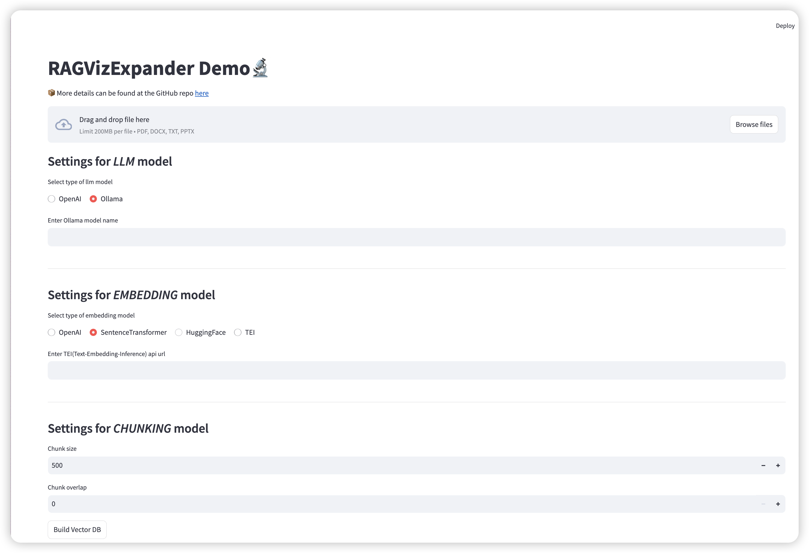

# RAGVizExpander

Welcome to `RAGVizExpander`, an extension of the RAGxplorer project, 
where we aim to incorporate new features tailored to personal interests and enhance the overall user experience.

You can use this program to test the effects of different embedding models and chunking strategies.

## Install

* Install from source
```bash
pip install -e .
```

* Install from PyPI
```bash
pip install ragvizexpander
```

## Components

Below are the components you can use:

| Type        |        What         |                       Where                       |
|:------------|:-------------------:| :-----------------------------------------------: |
| LLM         |       OpenAI        |                     Built-in                      |
|             |      `ollama`       |              [examples](./examples)               |
| Embedding   |       OpenAI        |                     Built-in                      |
|             | SentenceTransformer |                     Built-in                      |
|             |     HuggingFace     |                     Built-in                      |
|             |   Endpoint-based    |              [examples](./examples)               |
| File Loader |        DOCX         |                     Built-in                      |
|             |        PPTX         |                     Built-in                      |
|             |         TXT         |                     Built-in                      |
|             |         PDF         |                     Built-in                      |


## Document loader

| Type |     Tool     |                              Where                              |
|:-----|:------------:|:---------------------------------------------------------------:|
| WORD |   Default    |                                                                 |
|      | unstructured | [unstructured](https://github.com/Unstructured-IO/unstructured) |
|      | llama-index  |     [LlamaIndex](https://github.com/run-llama/llama_index)      |
|      |   docling    |           [Docling](https://github.com/DS4SD/docling)           |
| PDF  |   Default    |                                                                 |
|      | unstructured |                                                                 |
|      | llama-index  |                                                                 |
|      |   docling    |                                                                 |
| TXT  |   Default    |                                                                 |
|      | unstructured |                                                                 |
|      | llama-index  |                                                                 |
| PPTX |   Default    |                                                                 |
|      | unstructured |                                                                 |
|      | llama-index  |                                                                 |
|      |   docling    |                                                                 |


## DEMO



**Usge**: `streamlit run app.py`

**Huggingface Space**: [RagVizExpander](https://huggingface.co/spaces/KennyAI01/RagVizExpander)

# Features
- [x] Custom LLM & Embedding model
- [x] Custom chunking strategy
- [x] Support for parsing multiple types of files

# Acknowledgments 💙

- This project is forked from [RAGxplorer](https://github.com/gabrielchua/RAGxplorer?tab=readme-ov-file)

# License

This project is licensed under the MIT license - see the [LICENSE](LICENSE) for details.
